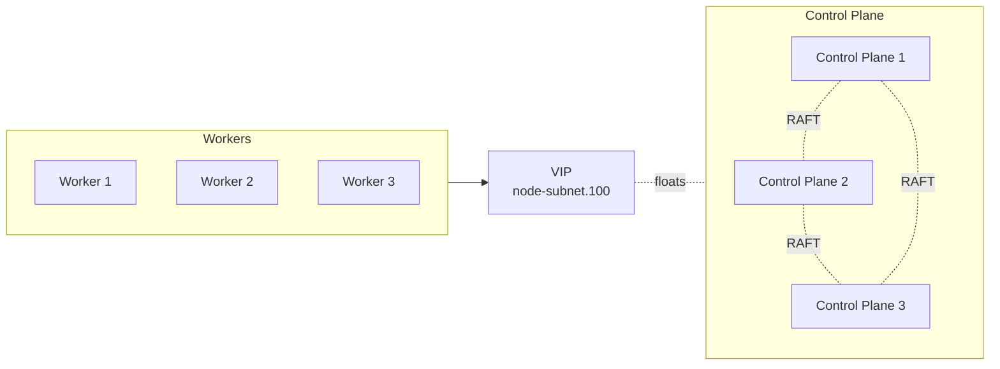
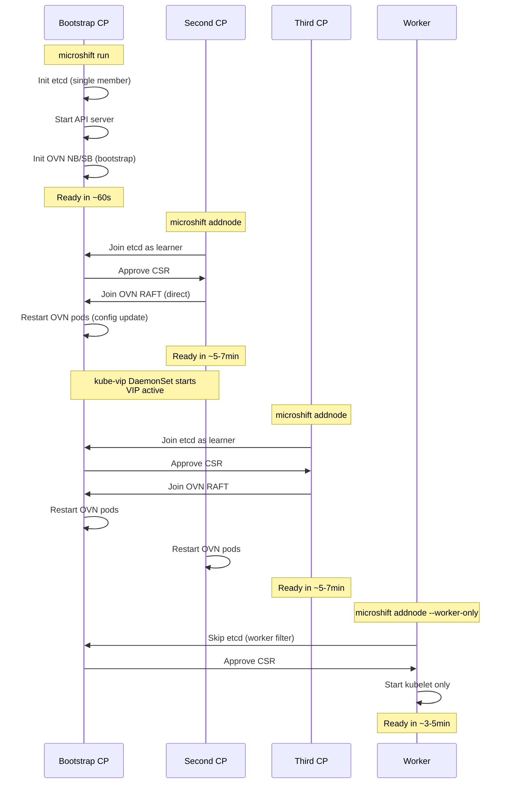

# MicroShift High Availability

Technical guide for MicroShift HA multinode deployments.

Target: Developers and system architects
Reading time: ~15 minutes
Tested: Image mode only (container-based deployment)

## Architecture

MicroShift HA uses three components for control plane high availability:

**etcd**: RAFT-based distributed key-value store for Kubernetes state
**OVN**: RAFT-based networking databases (NorthBound/SouthBound)
**kube-vip**: Virtual IP for API HA + LoadBalancer service provider

### Network Layout

Pod CIDR: `10.42.0.0/16` (Kubernetes pod network)
Service CIDR: `10.43.0.0/16` (Kubernetes service network, kube-apiserver VIP at `.1`)
VIP: Derived from node IP - `<node-subnet>.100` (floats among control planes)
LoadBalancer range: `<node-subnet>.101-.199` (for service type LoadBalancer)

The VIP and LoadBalancer ranges are automatically calculated from the first control plane's node IP address. For example, if the first node has IP `10.89.0.11`, the VIP becomes `10.89.0.100` and LoadBalancer services get IPs from `10.89.0.101-10.89.0.199`.



Ports required between control planes:
- 2379/2380: etcd client/peer
- 6443: kube-apiserver
- 9641-9644: OVN NB/SB client and RAFT
- 10250/10256/10257/10259: kubelet/kube-proxy/controller-manager/scheduler

## etcd HA

### Implementation

**Worker Filtering** (pkg/cmd/addnode.go):
`isControlPlaneNode()` checks node labels to prevent workers from joining etcd cluster. Only nodes with `node-role.kubernetes.io/master` or `node-role.kubernetes.io/control-plane` are added to `ETCD_INITIAL_CLUSTER`.

**WorkerOnly Mode** (pkg/config/multinode.go):
New flag `--worker-only` skips etcd member addition and control plane components while still writing cluster config for API access.

**Cluster Config** (pkg/cmd/addnode.go):
`writeClusterConfig()` creates `/var/lib/microshift/.cluster-config` with all control plane IPs. Used as fallback when K8s API unavailable. Parses IPs from `ETCD_INITIAL_CLUSTER` env var.

### Bootstrap Node

First control plane initializes etcd cluster, creates certs, starts API server. Should stay running during scale ops (not required but recommended). Restart-safe: rejoins using existing state.

### Quorum

etcd requires N/2+1 majority:
- 3 nodes = 2 required (tolerates 1 failure)
- 5 nodes = 3 required (tolerates 2 failures)
- **2 nodes = 2 required (NO fault tolerance)**

Network partition: minority side goes read-only, rejoins when healed.

### Debugging

```bash
# Built-in tool (no etcdctl needed)
podman exec microshift-okd-1 microshift-etcd member list

# With etcdctl (if available)
export ETCDCTL_API=3
export ETCDCTL_CACERT=/var/lib/microshift/certs/etcd-signer/ca.crt
export ETCDCTL_CERT=/var/lib/microshift/certs/etcd-signer/apiserver-etcd-client/client.crt
export ETCDCTL_KEY=/var/lib/microshift/certs/etcd-signer/apiserver-etcd-client/client.key
export ETCDCTL_ENDPOINTS=https://10.89.0.11:2379

etcdctl member list --write-out=table
etcdctl endpoint status --cluster --write-out=table
```

**Key files**: pkg/cmd/addnode.go (filtering logic), etcd/cmd/microshift-etcd/member.go (offline inspection), etcd/pkg/etcdmembers/members.go (BBolt reader)

## OVN HA

### Implementation

**Database Persistence** (assets/components/ovn/multi-node/master/daemonset.yaml):
OVN NB/SB databases stored in `/var/lib/microshift/ovn` hostPath volume. Survives pod restarts, enables RAFT cluster recovery.

**State Detection** (init container: ovn-state-detector):
Checks database state before starting OVN:
- **RESUME**: DB files exist → rejoin cluster using existing cluster ID
- **BOOTSTRAP**: No DB, no config → first CP, create new cluster
- **JOIN**: No DB, config exists → verify bootstrap node reachable on RAFT ports

**Cluster Formation** (pkg/config/ovn/ovn.go, pkg/components/networking.go):
Writes `/var/lib/microshift/ovn/config` with cluster IPs and ports for NB/SB databases. DaemonSet reads this for join parameters.

**ovn-ctl Parameters** (assets/components/ovn/multi-node/master/daemonset.yaml lines 142-453):
- `--db-nb-cluster-local-addr`: This node's IP for NB RAFT
- `--db-nb-cluster-remote-addr`: Bootstrap node IP for NB join
- `--db-sb-cluster-local-addr`: This node's IP for SB RAFT
- `--db-sb-cluster-remote-addr`: Bootstrap node IP for SB join

### RAFT Differences from etcd

OVN databases do NOT support learner mode. New nodes join directly as voting members. This can cause brief disruptions during 2→3 scaling.

### Pod Restarts During Scaling

Expected behavior when adding CPs:
1. DaemonSet config updated with new OVN_NB_DB_LIST
2. Existing pods restart (rolling update)
3. RAFT leader election occurs
4. Cluster self-heals within ~2 minutes

### Split-Brain Prevention

Init container refuses to bootstrap if it cannot reach existing cluster on RAFT ports (9643/9644). Goes into CrashLoopBackOff until network restored. This prevents duplicate clusters.

### Debugging

```bash
# Inside ovnkube-master pod
kubectl exec -n openshift-ovn-kubernetes ovnkube-master-XXX -c nbdb -- \
  ovn-appctl -t /var/run/ovn/ovnnb_db.ctl cluster/status OVN_Northbound

kubectl exec -n openshift-ovn-kubernetes ovnkube-master-XXX -c sbdb -- \
  ovn-appctl -t /var/run/ovn/ovnsb_db.ctl cluster/status OVN_Southbound

# Check RAFT leader and members
# "Servers:" line shows cluster members - if different across pods, split-brain exists
```

**Key files**: assets/components/ovn/multi-node/master/daemonset.yaml (state detection + ovn-ctl), pkg/config/ovn/ovn.go (config writer), pkg/components/networking.go (OVN config update logic)

## kube-vip

### Implementation

**DaemonSet** (assets/components/kube-vip/daemonset.yaml):
Runs on control planes only. Manages VIP (x.x.x.100) on `br-ex` interface using ARP. Leader election via Kubernetes leases.

**Cloud Provider** (assets/components/kube-vip/cloud-controller-deployment.yaml):
Watches LoadBalancer services, allocates IPs from range (x.x.x.101-199), updates service status. Runs on control planes with pod network (not hostNetwork).

**Deployment Logic** (pkg/components/kubevip.go):
- Bootstrap check: Only bootstrap node (with .enable-ha marker) deploys kube-vip resources
- Joining CPs: Skip deployment to prevent duplicates
- DaemonSet: Only deployed when HA mode enabled (VIP for API HA)
- Cloud provider: Only deployed when HA mode enabled (LoadBalancer service provider)
- Non-HA multinode: Uses built-in LoadBalancer controller instead

**IP Calculation** (pkg/components/kubevip.go):
Auto-calculates from node IP if not configured:
- VIP: Last octet → 100 (10.89.0.11 → 10.89.0.100)
- LB range: Last octet → 101-199 (10.89.0.11 → 10.89.0.101-199)

**Built-in Controller Disabled** (pkg/loadbalancerservice/controller.go):
MicroShift's built-in LoadBalancer controller disabled when HA mode enabled. kube-vip cloud provider handles LoadBalancer services in HA clusters. Non-HA multinode clusters use the built-in controller.

### Interface Choice

Uses `br-ex` (OVN gateway interface) instead of `eth0` to avoid conflicts with node's primary IP. VIP and advertiseAddress both live on br-ex as /32 addresses.

### SCC Requirements

**DaemonSet** (assets/components/kube-vip/scc.yaml):
Custom SCC grants: hostNetwork + NET_ADMIN + NET_RAW + SYS_TIME capabilities. Minimal permissions for ARP manipulation.

**Cloud Provider**: No SCC needed (regular pod network).

### RBAC

**DaemonSet** (assets/components/kube-vip/clusterrole.yaml):
Manages services, endpoints, endpointslices, nodes, configmaps, leases. Updates service/status for VIP assignment.

**Cloud Provider** (assets/components/kube-vip/cloud-controller-clusterrole.yaml):
Wildcard verbs on configmaps/endpoints/events/services/status/leases for IP allocation. Reads range from ConfigMap in kube-system namespace.

### Debugging

```bash
# Check VIP assignment
kubectl get pod -n kube-vip -o wide
podman exec okd-1 ip addr show br-ex | grep 10.89.0.100

# Check LoadBalancer services
kubectl get svc --all-namespaces | grep LoadBalancer

# Cloud provider logs
kubectl logs -n kube-vip kube-vip-cloud-controller-XXX
```

**Key files**: pkg/components/kubevip.go (deployment logic, IP calculation), assets/components/kube-vip/daemonset.yaml (VIP config), assets/components/kube-vip/cloud-controller-deployment.yaml (scheduling on CPs)

## Scaling Timeline

Measured on container-based deployments:

**First CP**: ~60s to Ready (bootstrap: etcd + API + OVN init)
**Additional CPs**: ~5-7 min to Ready (CSR approval + etcd learner + OVN RAFT join)
**Workers**: ~3-5 min to Ready (kubelet + CNI only)

## Limitations

- **Sequential node addition only**: Parallel joins cause race conditions in etcd/OVN cluster formation
- **No automated remove-node**: Manual etcd member removal required
- **2-node clusters discouraged**: etcd and OVN both need 2/2 quorum (no fault tolerance)
- **Image mode only**: Tested exclusively with container deployments
- **HA required for control planes**: Cannot add control planes to non-HA clusters (validated at runtime)

## Backward Compatibility

Existing tests and single-node deployments unaffected. MultiNode.Enabled flag gates all HA components.

## References

- OVN clustering: https://satishdotpatel.github.io/openstack-ansible-ovn-clustering/
- K8s HA best practices: https://www.anantacloud.com/post/why-a-3-node-kubernetes-control-plane-is-the-industry-standard
- kube-vip docs: https://kube-vip.io/docs/

## Flow Diagram


